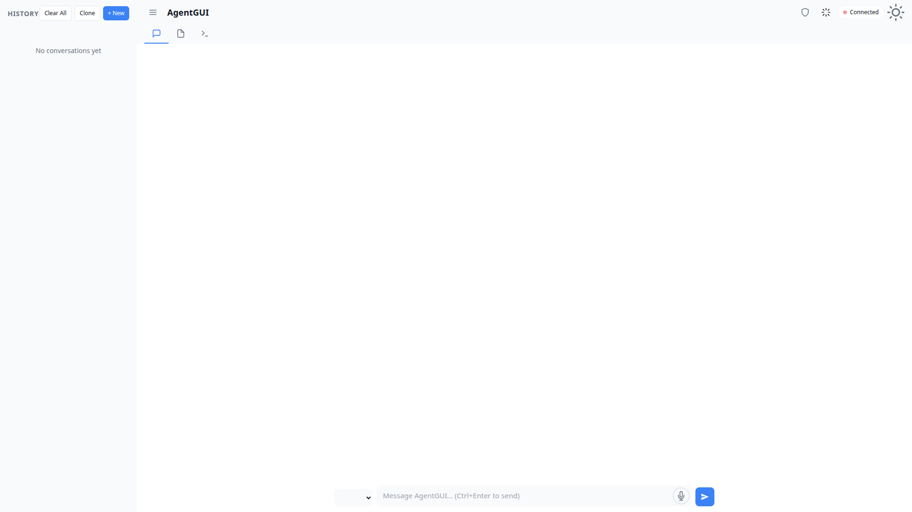
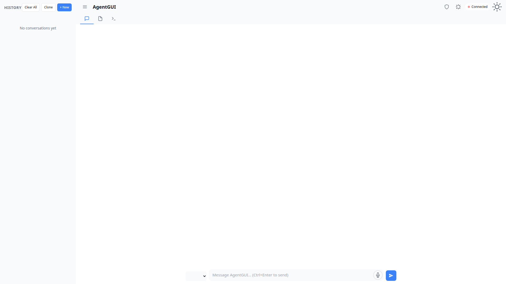
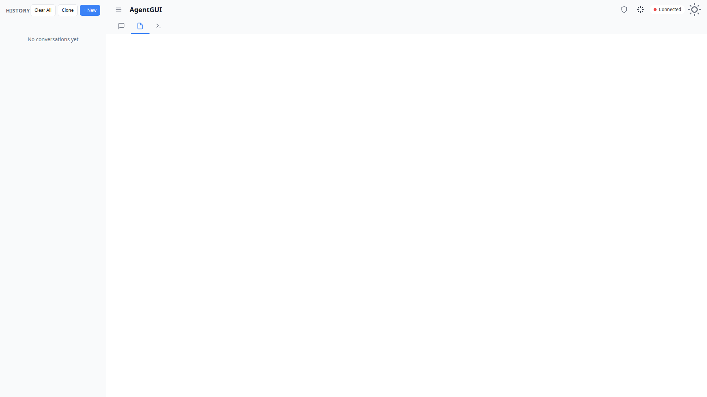
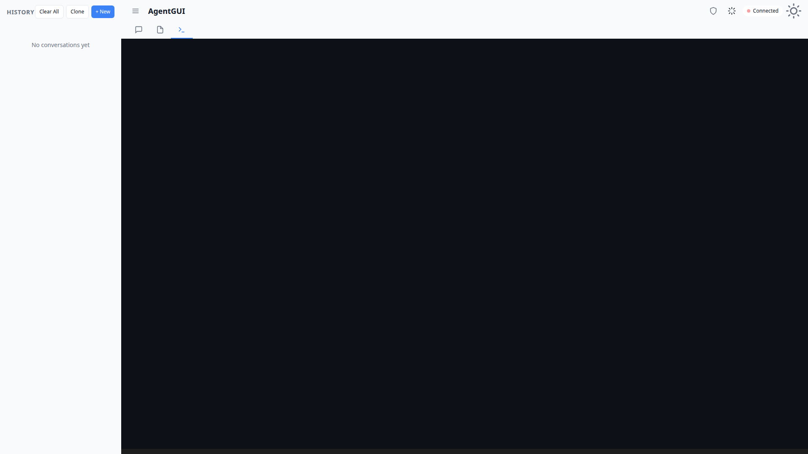
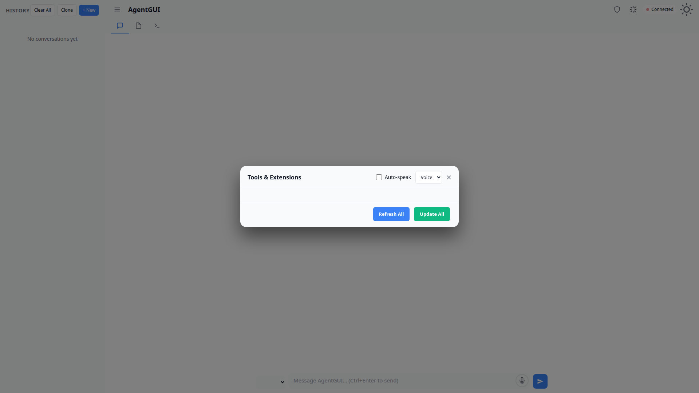
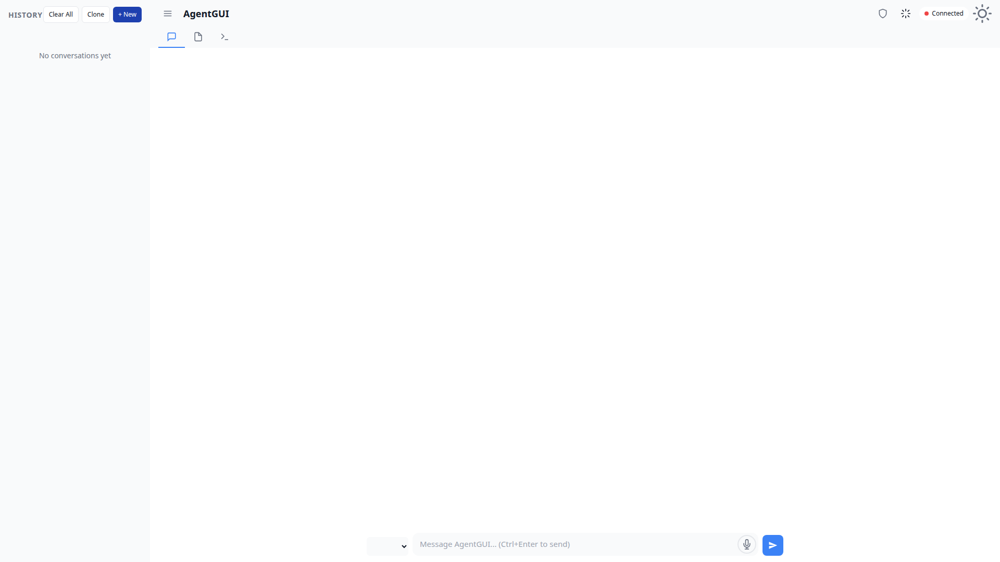

# AgentGUI

Multi-agent GUI client for AI coding agents (Claude Code, Gemini CLI, OpenCode, Goose, etc.) with real-time streaming, WebSocket sync, and SQLite persistence.



## Features

- **Real-time Agent Execution** - Watch agents work with streaming output and tool calls
- **Multi-Agent Support** - Switch between Claude Code, Gemini CLI, OpenCode, Kilo, and more
- **Session Management** - Full conversation history with SQLite persistence
- **WebSocket Sync** - Live updates across multiple clients
- **Voice Integration** - Speech-to-text and text-to-speech support
- **Tool Management** - Install and update agent plugins from the UI
- **File Browser** - Explore and manage conversation files

### Screenshots

| Main Interface | Chat View |
|----------------|-----------|
|  |  |

| Files Browser | Terminal View |
|---------------|---------------|
|  |  |

| Tools Management | Conversation |
|------------------|--------------|
|  |  |

## Quick Start

```bash
npm install
npm run dev
```

Server starts on `http://localhost:3000/gm/`

## System Requirements

- Node.js 18+
- SQLite 3
- Modern browser (Chrome, Firefox, Safari, Edge)

## Architecture

```
server.js              HTTP server + WebSocket + all API routes
database.js            SQLite setup (WAL mode), schema, query functions
lib/claude-runner.js   Agent framework - spawns CLI processes, parses stream-json output
lib/acp-manager.js     ACP tool lifecycle - auto-starts HTTP servers, restart on crash
lib/speech.js          Speech-to-text and text-to-speech via @huggingface/transformers
static/index.html      Main HTML shell
static/app.js          App initialization
static/js/client.js    Main client logic
static/js/conversations.js       Conversation management
static/js/streaming-renderer.js  Renders Claude streaming events as HTML
static/js/websocket-manager.js   WebSocket connection handling
```

### Key Details

- Agent discovery scans PATH for known CLI binaries at startup
- Database lives at `~/.gmgui/data.db`
- WebSocket endpoint at `/gm/sync`
- ACP tools (OpenCode, Kilo) auto-launch as HTTP servers on startup

## REST API

All routes prefixed with `/gm`:

- `GET /api/conversations` - List conversations
- `POST /api/conversations` - Create conversation
- `GET /api/conversations/:id` - Get conversation with streaming status
- `POST /api/conversations/:id/messages` - Send message
- `GET /api/agents` - List discovered agents
- `GET /api/tools` - List detected tools with installation status
- `POST /api/tools/:id/install` - Install tool
- `POST /api/stt` - Speech-to-text
- `POST /api/tts` - Text-to-speech

## Environment Variables

- `PORT` - Server port (default: 3000)
- `BASE_URL` - URL prefix (default: /gm)
- `STARTUP_CWD` - Working directory passed to agents

## Development

```bash
npm run dev        # Start with watch mode
npm start          # Production mode
```

## License

MIT
